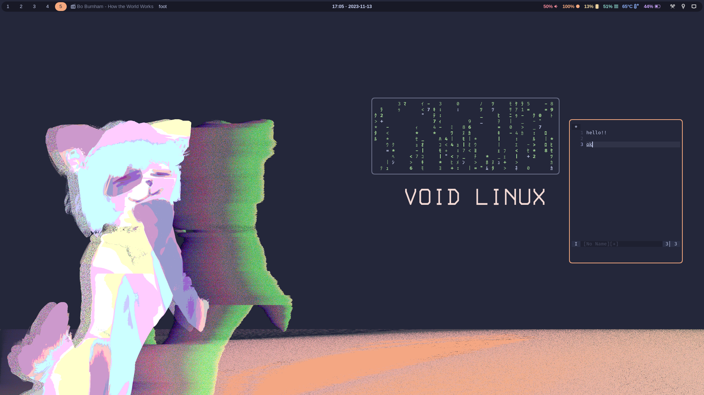

# dotfiles by callyral

these are my dotfiles :3

## installation

### step one: 

- make sure you have the necessary software listed in this README

- the README also contains some specifications, please read it!

### step two: 

root config (unmanaged by chezmoi)

- clone this repo

- move relevant things in [repo/path](path/) to somewhere in your `$PATH` (e.g `/usr/local/bin/`)

- move relevant things in [repo/usr](usr/) and in [repo/etc](etc/) to their respective directories in root

### step three:

- install [chezmoi](https://www.chezmoi.io) (dotfile management)

- `chezmoi init callyral`

- `chezmoi apply` to apply the dotfiles

## basic system info

[void linux](https://voidlinux.org)

- enter the void

[swayfx](https://github.com/WillPower3309/swayfx)

- i3-compatible wlroots window manager with eye-candy

- [autotiling](https://github.com/nwg-piotr/autotiling)

- [hyprpicker](https://github.com/hyprwm/hyprpicker)

- [swayidle](https://github.com/swaywm/swayidle)

- [swaylock](https://github.com/swaywm/swaylock)

- [Waybar](https://github.com/Alexays/Waybar)

## screenshots



## multimedia 

[PipeWire](https://pipewire.org)

- see [this void documentation](https://docs.voidlinux.org/config/media/pipewire.html)

- [WirePlumber](https://wiki.archlinux.org/title/WirePlumber)

  - session manager for pipewire

## fonts

[FiraCode](https://github.com/tonsky/FiraCode)

[Font Awesome](https://fontawesome.com)

[Noto Color Emoji](https://fonts.google.com/noto/specimen/Noto+Color+Emoji)

[Noto Sans](https://fonts.google.com/noto/specimen/Noto+Sans)

## terminal utilities

[bat](https://github.com/sharkdp/bat)

[bottom](https://github.com/ClementTsang/bottom)
  
- system monitor

[emptty](https://github.com/tvrzna/emptty)

- tty display manager

[eza](https://github.com/eza-community/eza)

- modern alternative to ls

[jawsfetch](https://github.com/callyral/jawsfetch)

- linux system information tool written in rust by me!

[neovim](https://neovim.io)
  
- configured with [fennel](https://fennel-lang.org)

- uses the [paq-nvim](https://github.com/savq/paq-nvim) package manager

  ```bash
  # install paq-nvim:
  git clone --depth=1 https://github.com/savq/paq-nvim.git \
      "${XDG_DATA_HOME:-$HOME/.local/share}"/nvim/site/pack/paqs/start/paq-nvim
  ```

- then, run `:PaqInstall` in neovim

- this list does not contain all my plugins, see [plugin_install.fnl](home/dot_config/nvim/fnl/plugin_install.fnl)

- [alpha-nvim](https://github.com/goolord/alpha-nvim)

  - greeter

- [catppuccin](https://github.com/catppuccin/nvim)

- [coq_nvim](https://github.com/ms-jpq/coq_nvim)

  - really fast completion

- [gitsigns.nvim](https://github.com/lewis6991/gitsigns.nvim)

- [mini.nvim](https://github.com/echasnovski/mini.nvim)

  - mini.tabline, mini.statusline, mini.comment, mini.pick and mini.jump2d

- [tangerine.nvim](https://github.com/udayvir-singh/tangerine.nvim)

  - add easy fennel support to neovim config

- [treesitter](https://github.com/nvim-treesitter/nvim-treesitter)

  - better code highlighting

[nushell](https://nushell.sh)

- really nice although experimental shell

- [starship](https://starship.rs)

  - very customizable shell prompt

## apps

[dunst](https://dunst-project.org)

- notification daemon

[foot](https://codeberg.org/dnkl/foot)

- terminal emulator

[firefox](https://www.mozilla.org/en-US/firefox/new/)

- TODO: add theme configuration to repo

- themed with [SimpleFox](https://github.com/migueravila/SimpleFox)

[pcmanfm](https://github.com/lxde/pcmanfm)

- graphical file manager

[zathura](https://pwmt.org/projects/zathura)

- document viewer

## other software

[CopyQ](https://github.com/hluk/CopyQ)

- clipboard management

[gammastep](https://gitlab.com/chinstrap/gammastep)

- adjust the screen's color temperature

- gammastep-indicator

  - applet for gammastep

[NetworkManager](https://networkmanager.dev/)

- network managemement

- [iwd](https://iwd.wiki.kernel.org/)

  - backend for NetworkManager

- [network-manager-applet](https://gitlab.gnome.org/GNOME/network-manager-applet)

[wofi-emoji](https://github.com/Zeioth/wofi-emoji)

- emoji selector script for wofi

## themes

[catppuccin macchiato peach](https://github.com/catppuccin/catppuccin)

- a soothing pastel theme for the high-spirited

- [catppuccin for dunst](https://github.com/catppuccin/dunst)

- [catppuccin for firefox](https://github.com/catppuccin/firefox)

- [catppuccin for foot](https://github.com/catppuccin/foot)

- [catppuccin for gtk](https://github.com/catppuccin/gtk)

  - follow [these instructions](https://github.com/catppuccin/gtk)

- [catppuccin for kvantum](https://github.com/catppuccin/Kvantum)

- [catppuccin for qt5ct](https://github.com/catppuccin/qt5ct)

- [catppuccin for waybar](https://github.com/catppuccin/waybar)

## wallpaper

made by me using [krita](https://krita.org)


